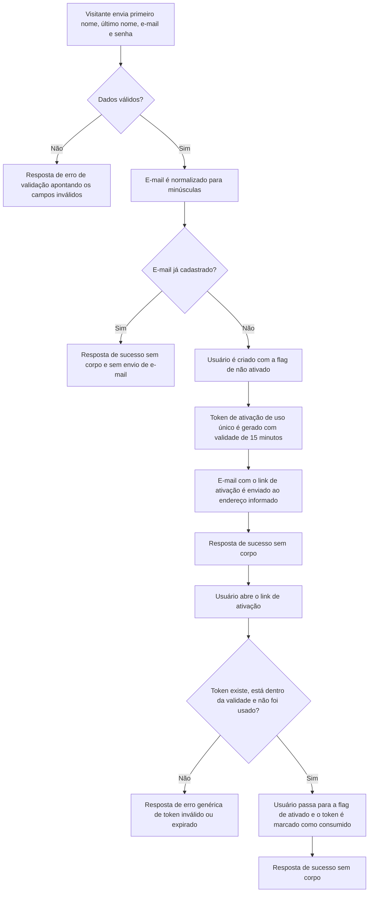

# PRD: Cadastro de Usuários

## Visão Geral

O Fincheck ainda não possui nenhuma forma de identificar quem está usando a API. Sem cadastro não há como associar contas, transações e categorias a um dono, o que bloqueia toda a proposta de gerenciamento de finanças pessoais. Além disso, como o produto pretende ser consumido por aplicações web, mobile e agentes de IA, o cadastro precisa ser uma porta de entrada única, previsível e segura para todos esses clientes.

Esta funcionalidade entrega o cadastro de novos usuários e a confirmação de propriedade do endereço de e-mail informado. O objetivo é permitir que qualquer pessoa crie sua conta informando primeiro nome, último nome, e-mail e senha, receba um e-mail com um link de ativação válido por 15 minutos e de uso único, e conclua a ativação da conta. O e-mail é o identificador único do usuário, tratado de forma insensível a maiúsculas e minúsculas, garantindo que a mesma pessoa não crie contas duplicadas por diferença de capitalização. Apelidos de e-mail (subendereçamento com `+`) são preservados e valem como endereços distintos. Tentativas de cadastro com um e-mail já registrado devem responder com sucesso e sem enviar e-mail, evitando que a API funcione como um oráculo que revela quais endereços já possuem conta.

## Fluxo Esperado

## Personas

| Nome             | Profissão                 | Salário      | Motivação                                                                                                                                                      |
| :--------------- | :------------------------ | :----------- | :------------------------------------------------------------------------------------------------------------------------------------------------------------- |
| Tifa Lockhart    | Analista de marketing     | R$ 6.400,00  | Quer parar de controlar gastos em planilhas e precisa de uma conta própria para registrar suas finanças com segurança e acessá-las do celular e do computador. |
| Mateus Rodrigues | Desenvolvedor de software | R$ 12.500,00 | Quer conectar um agente de IA à API para consultar seus gastos por comando de voz e precisa de uma conta confirmada antes de emitir credenciais de acesso.     |
| Julia Farias     | Autônoma (confeiteira)    | R$ 3.900,00  | Mistura dinheiro pessoal e do negócio e precisa de um cadastro simples e rápido, sem etapas confusas, para começar a separar as finanças ainda hoje.           |

## Histórias de Usuários

| #     | Descrição                                                                                                                                                                                                                                                                             |
| :---- | :------------------------------------------------------------------------------------------------------------------------------------------------------------------------------------------------------------------------------------------------------------------------------------ |
| US-01 | Como visitante, gostaria de criar uma conta informando primeiro nome, último nome, e-mail e senha para que eu possa passar a usar o Fincheck.                                                                                                                                         |
| US-02 | Como visitante, gostaria de receber mensagens de erro que apontem exatamente quais campos estão inválidos para que eu possa corrigir o cadastro sem tentativa e erro.                                                                                                                 |
| US-03 | Como visitante, gostaria de receber um e-mail com um link de ativação após o cadastro para que eu possa comprovar que o endereço informado é meu.                                                                                                                                     |
| US-04 | Como novo usuário, gostaria de ativar minha conta abrindo o link recebido por e-mail para que eu possa começar a usar o produto.                                                                                                                                                      |
| US-05 | Como novo usuário, gostaria que o link de ativação perdesse a validade rapidamente e servisse uma única vez para que ninguém consiga ativar minha conta caso o e-mail seja acessado por terceiros.                                                                                    |
| US-06 | Como usuário já cadastrado, gostaria que uma tentativa de cadastro com o meu e-mail não gerasse e-mails para a minha caixa de entrada nem revelasse que já possuo conta, para que minha privacidade seja preservada.                                                                  |
| US-07 | Como usuário, gostaria que variações do meu e-mail em maiúsculas e minúsculas fossem tratadas como o mesmo endereço, e que apelidos continuassem valendo como endereços distintos, para que eu não crie contas duplicadas por engano e ainda possa usar apelidos para separar contas. |

## Critérios de Aceitação

| #     | Descrição                                                                                                                                                                                                                                                              | História de Usuário |
| :---- | :--------------------------------------------------------------------------------------------------------------------------------------------------------------------------------------------------------------------------------------------------------------------- | :------------------ |
| CA-01 | Dado que informo primeiro nome, último nome, e-mail válido e senha válida, e o e-mail ainda não está cadastrado, quando envio a requisição de cadastro, então recebo uma resposta de sucesso com corpo vazio.                                                          | US-01               |
| CA-02 | Dado que meu cadastro foi concluído com sucesso, quando o usuário é criado, então ele fica registrado com a flag de ativação em falso.                                                                                                                                 | US-01               |
| CA-03 | Dado que omito qualquer um dos campos primeiro nome, último nome, e-mail ou senha, quando envio a requisição de cadastro, então recebo um erro de validação apontando cada campo ausente e nenhum usuário é criado.                                                    | US-02               |
| CA-04 | Dado que informo um primeiro nome ou um último nome vazio ou com mais de 100 caracteres, quando envio a requisição de cadastro, então recebo um erro de validação apontando o campo correspondente e nenhum usuário é criado.                                          | US-02               |
| CA-05 | Dado que informo um e-mail em formato inválido, quando envio a requisição de cadastro, então recebo um erro de validação apontando o campo de e-mail e nenhum usuário é criado.                                                                                        | US-02               |
| CA-06 | Dado que informo uma senha com menos de 8 caracteres ou com mais de 64 caracteres, quando envio a requisição de cadastro, então recebo um erro de validação apontando o campo de senha e nenhum usuário é criado.                                                      | US-02               |
| CA-07 | Dado que meu cadastro foi concluído com sucesso, quando a requisição é processada, então um e-mail remetido por `noreply@fincheck.com.br` contendo o link de ativação no formato `<APP_WEB_URL>/auth/users/activations?token=<token>` é enviado ao endereço informado. | US-03               |
| CA-08 | Dado que dois usuários diferentes se cadastram, quando os tokens de ativação são gerados, então cada usuário recebe um token distinto.                                                                                                                                 | US-03               |
| CA-09 | Dado que possuo um token de ativação válido e ainda não utilizado, quando envio a requisição de ativação com esse token, então recebo uma resposta de sucesso com corpo vazio e minha conta passa a ter a flag de ativação em verdadeiro.                              | US-04               |
| CA-10 | Dado que informo um token de ativação inexistente, quando envio a requisição de ativação, então recebo o erro genérico de token inválido ou expirado e nenhuma conta é ativada.                                                                                        | US-05               |
| CA-11 | Dado que possuo um token de ativação gerado há mais de 15 minutos, quando envio a requisição de ativação com esse token, então recebo o erro genérico de token inválido ou expirado e minha conta permanece não ativada.                                               | US-05               |
| CA-12 | Dado que já utilizei meu token de ativação com sucesso, quando envio a requisição de ativação novamente com o mesmo token, então recebo o erro genérico de token inválido ou expirado e minha conta permanece ativada.                                                 | US-05               |
| CA-13 | Dado que meu e-mail já está cadastrado, quando alguém envia uma requisição de cadastro com esse mesmo e-mail, então a resposta é de sucesso com corpo vazio, nenhum novo usuário é criado e nenhum e-mail é enviado.                                                   | US-06               |
| CA-14 | Dado que meu e-mail já está cadastrado e minha conta ainda não foi ativada, quando alguém envia uma requisição de cadastro com esse mesmo e-mail, então a resposta é de sucesso com corpo vazio, nenhum e-mail é enviado e nenhum token novo é gerado.                 | US-06               |
| CA-15 | Dado que me cadastrei com `tifa.lockhart@gmail.com`, quando envio uma nova requisição de cadastro com `TIFA.LOCKHART@GMAIL.COM`, então a tentativa é tratada como e-mail já cadastrado e nenhum novo usuário é criado.                                                 | US-07               |
| CA-16 | Dado que me cadastrei com `tifa.lockhart@gmail.com`, quando envio uma nova requisição de cadastro com `tifa.lockhart+jogos@gmail.com`, então um novo usuário é criado e o e-mail de ativação é enviado para o endereço com apelido.                                    | US-07               |
| CA-17 | Dado que me cadastro informando `Tifa.Lockhart+Jogos@Gmail.com`, quando o usuário é criado, então o e-mail é armazenado como `tifa.lockhart+jogos@gmail.com` e o e-mail de ativação é enviado para esse endereço normalizado.                                          | US-07               |

## Integrações

- **Resend**: provedor externo responsável por entregar o e-mail de ativação ao endereço informado no cadastro. Os e-mails são enviados a partir de `noreply@fincheck.com.br`, endereço que não recebe respostas. As credenciais de acesso são configuráveis por ambiente. O envio precisa ser dublado nos testes automatizados, conforme o padrão de testes do projeto.
- **Aplicação web do Fincheck**: consome o link de ativação recebido pelo usuário. O endereço base da aplicação, incluindo o protocolo, é configurável por ambiente através de `APP_WEB_URL`, e a página `/auth/users/activations` é responsável por ler o token da query string e acionar a API.

## Fora de Escopo

- Reenvio do e-mail de ativação e qualquer fluxo de recuperação de token expirado;
- Autenticação (login), emissão de sessões, tokens de acesso ou credenciais de API;
- Recuperação e redefinição de senha;
- Edição, exclusão, listagem ou consulta de usuários;
- Cadastro ou autenticação através de provedores externos (Google, GitHub, etc.);
- Bloqueio de provedores de e-mail temporário ou descartável e de apelidos de e-mail (subendereçamento);
- Limitação de taxa (rate limiting) e proteção contra automação no cadastro;
- Restrições de complexidade de senha além dos limites de tamanho mínimo e máximo;
- Restrição de caracteres nos campos de primeiro e último nome;
- Implementação da página web `/auth/users/activations`;
- Internacionalização das mensagens do e-mail de ativação e das mensagens de erro.
