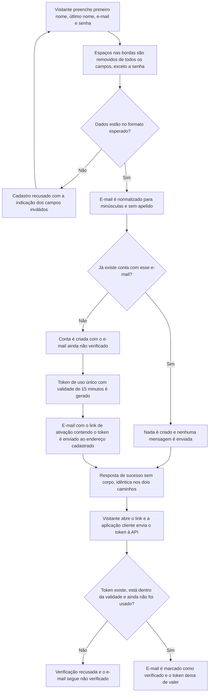

# PRD: Cadastro de Usuários

## Visão Geral

O Fincheck é uma API de finanças pessoais consumida por aplicações web, mobile e agentes de IA. Hoje não existe nenhuma forma de uma pessoa passar a ter uma conta no produto, o que impede qualquer outro recurso de existir: sem conta, não há a quem associar contas bancárias, transações ou categorias. Esta funcionalidade entrega o ponto de entrada do produto: um visitante (pessoa não autenticada) cria sua conta informando primeiro nome, último nome, endereço de e-mail e senha, e em seguida ativa a conta clicando em um link enviado ao endereço informado.

O objetivo é oferecer um cadastro simples, previsível e livre de duplicidades, sem expor quem já é cliente do produto. O e-mail é o identificador da pessoa, então endereços que representam a mesma caixa de entrada — variações de caixa alta/baixa e apelidos criados com o sufixo `+` — são o mesmo endereço. Quando o e-mail já pertence a alguém, a API responde exatamente como responderia a um cadastro novo, mas não cria nada e não envia mensagem alguma, de modo que ninguém consiga descobrir, a partir das respostas, quem tem conta no Fincheck. O cadastro conclui sem iniciar sessão: autenticar é responsabilidade de uma funcionalidade futura.

## Fluxo Esperado

## Personas

| Nome             | Profissão                      | Salário      | Motivação                                                                                                                                                    |
| :--------------- | :----------------------------- | :----------- | :----------------------------------------------------------------------------------------------------------------------------------------------------------- |
| Tifa Lockhart    | Analista de suporte pleno      | R$ 4.500,00  | Cansou de controlar gastos em planilhas e quer um lugar único para acompanhar suas finanças; precisa criar a conta em menos de um minuto, pelo celular       |
| Mateus Rodrigues | Desenvolvedor front-end sênior | R$ 12.000,00 | Está construindo um app cliente sobre a API do Fincheck e precisa de um contrato previsível para encadear cadastro e ativação de conta na interface          |
| Julia Farias     | Autônoma (designer)            | R$ 6.200,00  | Usa vários apelidos de e-mail para separar assinaturas, não quer contas duplicadas e não quer que terceiros descubram onde ela mantém seus dados financeiros |

## Histórias de Usuários

| #    | Descrição                                                                                                                                                                   |
| :--- | :-------------------------------------------------------------------------------------------------------------------------------------------------------------------------- |
| US-1 | Como visitante, gostaria de criar uma conta informando primeiro nome, último nome, e-mail e senha, para que eu possa passar a usar o Fincheck                               |
| US-2 | Como visitante, gostaria de ser informado sobre quais dados enviei fora do formato aceito, para que eu possa corrigi-los e concluir o cadastro                              |
| US-3 | Como visitante recém-cadastrado, gostaria de receber um link de ativação no e-mail que informei, para que eu possa comprovar que aquele endereço é meu sem digitar nada     |
| US-4 | Como visitante recém-cadastrado, gostaria de ativar minha conta apenas abrindo o link recebido, para que meu e-mail passe a constar como verificado                         |
| US-5 | Como visitante, gostaria que variações de caixa e apelidos do meu e-mail sejam reconhecidos como o mesmo endereço, para que eu não acabe com contas duplicadas              |
| US-6 | Como pessoa já cadastrada, gostaria que as respostas da API não revelem que possuo conta no Fincheck, para que terceiros não descubram onde mantenho meus dados financeiros |
| US-7 | Como aplicação cliente, gostaria que cadastro e verificação respondam sem corpo e sem sessão, para que eu controle a navegação entre as telas do fluxo                      |

## Critérios de Aceitação

| #     | Descrição                                                                                                                                                                                                                                                                  | História de Usuário |
| :---- | :------------------------------------------------------------------------------------------------------------------------------------------------------------------------------------------------------------------------------------------------------------------------- | :------------------ |
| CA-1  | Dado que sou um visitante não autenticado, quando envio primeiro nome, último nome, e-mail e senha válidos, então minha conta é criada com o e-mail marcado como não verificado                                                                                            | US-1                |
| CA-2  | Dado que omito qualquer um dos campos primeiro nome, último nome, e-mail ou senha, quando envio o cadastro, então ele é recusado indicando o campo ausente e nenhuma conta é criada                                                                                        | US-2                |
| CA-3  | Dado que informo um primeiro nome com menos de 2 ou mais de 100 caracteres, quando envio o cadastro, então ele é recusado indicando o primeiro nome como inválido e nenhuma conta é criada                                                                                 | US-2                |
| CA-4  | Dado que informo um último nome com menos de 2 ou mais de 100 caracteres, quando envio o cadastro, então ele é recusado indicando o último nome como inválido e nenhuma conta é criada                                                                                     | US-2                |
| CA-5  | Dado que informo uma senha com menos de 8 ou mais de 64 caracteres, quando envio o cadastro, então ele é recusado indicando a senha como inválida e nenhuma conta é criada                                                                                                 | US-2                |
| CA-6  | Dado que informo uma senha entre 8 e 64 caracteres, quando envio o cadastro, então nenhuma outra exigência de composição é aplicada e a senha é aceita                                                                                                                     | US-2                |
| CA-7  | Dado que informo um e-mail em formato inválido, quando envio o cadastro, então ele é recusado indicando o e-mail como inválido e nenhuma conta é criada                                                                                                                    | US-2                |
| CA-8  | Dado que envio mais de um campo fora do formato aceito, quando envio o cadastro, então a recusa aponta todos os campos inválidos de uma só vez                                                                                                                             | US-2                |
| CA-9  | Dado que informo primeiro nome, último nome ou e-mail com espaços em branco no início ou no fim, quando envio o cadastro, então os espaços das bordas são removidos antes da validação e o valor registrado não os contém                                                  | US-2                |
| CA-10 | Dado que informo um primeiro nome ou último nome composto apenas por espaços em branco, quando envio o cadastro, então ele é recusado por não atingir o mínimo de 2 caracteres e nenhuma conta é criada                                                                    | US-2                |
| CA-11 | Dado que informo um primeiro nome ou último nome cujo conteúdo tem até 100 caracteres somados a espaços nas bordas, quando envio o cadastro, então ele é aceito, pois os espaços das bordas não contam para o limite                                                       | US-2                |
| CA-12 | Dado que informo uma senha com espaços em branco no início ou no fim, quando envio o cadastro, então esses espaços contam para o limite de 8 a 64 caracteres e a senha não é alterada                                                                                      | US-2                |
| CA-13 | Dado que meu cadastro foi concluído com sucesso, quando a conta é criada, então um e-mail contendo o link de ativação é enviado ao endereço cadastrado, e somente a ele                                                                                                    | US-3                |
| CA-14 | Dado que recebi o e-mail de ativação, quando observo o link, então ele aponta para a página de verificação da aplicação cliente e carrega o token como parâmetro de consulta, no formato `https://app.fincheck.com.br/users/verify?token=7f6cad6c70faeeeaedbe9e03f3e18684` | US-3                |
| CA-15 | Dado que vários visitantes se cadastram, quando comparo os tokens gerados, então cada token é único no produto e não pode ser deduzido a partir de outro token ou dos dados informados no cadastro                                                                         | US-3                |
| CA-16 | Dado que meu token foi gerado, quando se passam mais de 15 minutos desde o cadastro, então o token deixa de ser válido                                                                                                                                                     | US-3                |
| CA-17 | Dado que recebi meu link de ativação, quando o token é enviado à verificação dentro dos 15 minutos de validade, então meu e-mail passa a constar como verificado                                                                                                           | US-4                |
| CA-18 | Dado que envio a verificação, quando informo somente o token, então a requisição é aceita sem exigir e-mail, senha ou qualquer outra credencial                                                                                                                            | US-4                |
| CA-19 | Dado que envio um token que não corresponde a nenhuma conta, quando tento verificar, então a requisição é recusada e nenhuma conta é alterada                                                                                                                              | US-4                |
| CA-20 | Dado que se passaram mais de 15 minutos desde o cadastro, quando envio o token correto, então a verificação é recusada e meu e-mail permanece não verificado                                                                                                               | US-4                |
| CA-21 | Dado que meu e-mail já foi verificado com aquele token, quando envio o mesmo token novamente, então a requisição é recusada, pois o token vale por um único uso, e minha conta segue verificada                                                                            | US-4                |
| CA-22 | Dado que altero qualquer caractere do token recebido, inclusive trocando sua caixa, quando envio a verificação, então ela é recusada, pois o token é comparado exatamente como consta no link                                                                              | US-4                |
| CA-23 | Dado que existem duas contas não verificadas, quando envio o token de uma delas, então somente a conta que originou aquele token passa a constar como verificada                                                                                                           | US-4                |
| CA-24 | Dado que não existe conta alguma, quando me cadastro com `Erick+Trabalho@Fincheck.com.br`, então a conta é criada e o e-mail registrado é `erick@fincheck.com.br`                                                                                                          | US-5                |
| CA-25 | Dado que existe uma conta com o e-mail `erick@fincheck.com.br`, quando me cadastro com `er.ick@fincheck.com.br`, então uma nova conta é criada, pois pontos no nome do usuário não caracterizam apelido                                                                    | US-5                |
| CA-26 | Dado que existe uma conta com o e-mail `erick@fincheck.com.br`, quando envio o cadastro com esse mesmo e-mail, então nenhuma conta adicional é criada e os dados da conta original permanecem inalterados                                                                  | US-6                |
| CA-27 | Dado que existe uma conta com o e-mail `erick@fincheck.com.br`, quando envio o cadastro com `ERICK@FINCHECK.COM.BR`, `erick+1@fincheck.com.br` ou o endereço cercado por espaços, então nenhuma conta adicional é criada                                                   | US-6                |
| CA-28 | Dado que envio o cadastro com um e-mail que já possui conta, quando a requisição é concluída, então nenhum e-mail é enviado a esse endereço                                                                                                                                | US-6                |
| CA-29 | Dado que a conta existente ainda não teve o e-mail verificado, quando alguém envia o cadastro novamente com esse e-mail, então nenhum e-mail é enviado e o token gerado no cadastro original continua sendo o único válido                                                 | US-6                |
| CA-30 | Dado que comparo a resposta de um cadastro com e-mail inédito e a de um cadastro com e-mail já existente, quando ambos os dados são válidos, então as duas respostas são indistinguíveis em conteúdo e em código de status                                                 | US-6                |
| CA-31 | Dado que envio um token desconhecido, um token expirado ou um token já utilizado, quando comparo as três respostas, então elas são indistinguíveis entre si                                                                                                                | US-6                |
| CA-32 | Dado que envio um cadastro válido, quando ele é concluído com sucesso, então a resposta indica sucesso e o corpo da resposta é vazio                                                                                                                                       | US-7                |
| CA-33 | Dado que envio uma verificação válida, quando ela é concluída com sucesso, então a resposta indica sucesso e o corpo da resposta é vazio                                                                                                                                   | US-7                |
| CA-34 | Dado que envio um cadastro ou uma verificação válidos, quando são concluídos com sucesso, então nenhuma credencial de sessão é devolvida e nenhuma sessão é iniciada                                                                                                       | US-7                |
| CA-35 | Dado que omito o token na verificação, quando envio a requisição, então ela é recusada indicando o campo ausente                                                                                                                                                           | US-7                |

## Integrações

| Sistema | Uso                                                                                                  |
| :------ | :--------------------------------------------------------------------------------------------------- |
| Resend  | Provedor de e-mail transacional que entrega a mensagem com o link de ativação ao endereço cadastrado |

## Fora de Escopo

- Reenvio do link de ativação e emissão de um novo token para uma conta já cadastrada — será oferecido no fluxo de login, em funcionalidade futura, e é o caminho previsto para quem perder o e-mail ou deixar os 15 minutos expirarem;
- Autenticação, emissão de sessão, tokens de acesso ou renovação de credenciais;
- Restrição de acesso a recursos do produto conforme o e-mail esteja verificado ou não;
- A página de verificação da aplicação cliente que recebe o link e chama a API;
- Recuperação e redefinição de senha;
- Alteração do endereço de e-mail de uma conta existente;
- Expurgo de contas que nunca tiveram o e-mail verificado e de tokens expirados;
- Cadastro por provedores externos (Google, GitHub, Apple, etc.);
- Consulta, edição, desativação ou exclusão de contas já criadas;
- Bloqueio de senhas notoriamente fracas ou vazadas e exigências de composição de senha;
- Regras de normalização específicas por provedor de e-mail (ex.: pontos ignorados pelo Gmail) e bloqueio de domínios descartáveis;
- Limite de tentativas de cadastro ou de verificação, proteção contra automação (CAPTCHA) e demais defesas contra abuso;
- Personalização visual, versões em outros idiomas e acompanhamento de entrega do e-mail de ativação;
- Aceite de termos de uso, política de privacidade e comunicações de marketing;
- Convite ou vínculo entre contas (contas compartilhadas, familiares ou de equipe);
- Qualquer interface visual de cadastro ou de ativação — a entrega é o comportamento da API.
