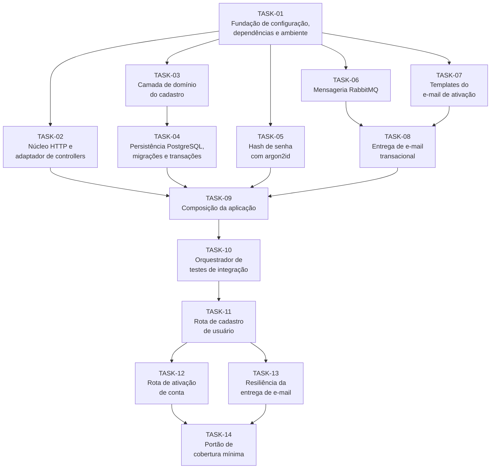

# Tarefas: Cadastro de Usuários

## Caminho Crítico

`TASK-01` é o gargalo inicial: ela mexe em `package.json`, `tsconfig.json`, `config.ts` e nos arquivos de ambiente, então nada pode rodar em paralelo com ela. Uma vez concluída, cinco tarefas abrem ao mesmo tempo, porque `TASK-02`, `TASK-03`, `TASK-05`, `TASK-06` e `TASK-07` escrevem em diretórios disjuntos e não se conhecem.

O caminho mais longo passa por `TASK-01 → TASK-06 → TASK-08 → TASK-09 → TASK-10 → TASK-11 → TASK-12 → TASK-14`, com oito tarefas em série. `TASK-09` é o segundo gargalo, por ser o único ponto de composição da aplicação, e `TASK-11` é o terceiro, porque cria os utilitários de cadastro e de leitura do token no orquestrador dos quais `TASK-12` e `TASK-13` dependem.

`TASK-12` e `TASK-13` voltam a abrir em paralelo: a primeira mexe em `router.ts`, `app.ts`, casos de uso e controllers; a segunda só toca em suítes e utilitários de teste. `TASK-14` fica isolada no fim de propósito, porque habilitar o limite de 90% de cobertura antes de a suíte estar completa reprovaria os portões de qualidade de todas as tarefas anteriores.

## Ondas

| #     | Tarefas                                     |
| :---- | :------------------------------------------ |
| OND-1 | TASK-01                                     |
| OND-2 | TASK-02, TASK-03, TASK-05, TASK-06, TASK-07 |
| OND-3 | TASK-04, TASK-08                            |
| OND-4 | TASK-09                                     |
| OND-5 | TASK-10                                     |
| OND-6 | TASK-11                                     |
| OND-7 | TASK-12, TASK-13                            |
| OND-8 | TASK-14                                     |
