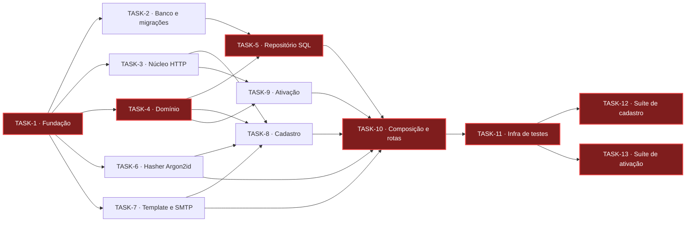

# Kanban: Cadastro de Usuários

## Andamento

A implementação é dividida em 6 ondas e 13 tarefas. A onda 1 estabelece a fundação técnica que todas as demais consomem; a onda 2 constrói em paralelo as quatro frentes independentes (banco, núcleo HTTP, domínio, hash e e-mail); a onda 3 implementa persistência e casos de uso; a onda 4 conecta tudo no servidor; a onda 5 entrega a infraestrutura de testes e a onda 6 cobre os critérios de aceitação com as duas suítes blackbox.

| #       | Título                                                                           | Status          | Bloqueado Por                          |
| :------ | :------------------------------------------------------------------------------- | :-------------- | -------------------------------------- |
| TASK-1  | Fundação do projeto: dependências, apelidos de módulo e configuração de ambiente | ✅ Concluído    |                                        |
| TASK-2  | Conexão com o PostgreSQL e migrações do esquema                                  | ✅ Concluído    | TASK-1                                 |
| TASK-3  | Núcleo HTTP: contrato de controller, `204 No Content` e adaptador do Fastify     | 🔄 Em Progresso | TASK-1                                 |
| TASK-4  | Domínio: `Email`, `User`, `UserActivationToken` e o contrato `UserRepository`    | ✅ Concluído    | TASK-1                                 |
| TASK-5  | Repositório de usuários em SQL                                                   | ✏️ Não Iniciado | TASK-2, TASK-4                         |
| TASK-6  | Derivação de hash de senha com Argon2id                                          | ✅ Concluído    | TASK-1                                 |
| TASK-7  | Template do e-mail de ativação e gateway SMTP                                    | ✏️ Não Iniciado | TASK-1                                 |
| TASK-8  | Cadastro: caso de uso e controller de `POST /v1/auth/users`                      | ✏️ Não Iniciado | TASK-3, TASK-4, TASK-6, TASK-7         |
| TASK-9  | Ativação: caso de uso e controller de `POST /v1/auth/users/activations`          | ✏️ Não Iniciado | TASK-3, TASK-4                         |
| TASK-10 | Composição da aplicação e declaração das rotas                                   | ✏️ Não Iniciado | TASK-5, TASK-6, TASK-7, TASK-8, TASK-9 |
| TASK-11 | Infraestrutura de testes: orquestrador, caixa de entrada e geradores de dados    | ✏️ Não Iniciado | TASK-10                                |
| TASK-12 | Suíte blackbox de `POST /v1/auth/users`                                          | ✏️ Não Iniciado | TASK-11                                |
| TASK-13 | Suíte blackbox de `POST /v1/auth/users/activations`                              | ✏️ Não Iniciado | TASK-11                                |

## Caminho Crítico

O caminho crítico é `TASK-1 → TASK-4 → TASK-5 → TASK-10 → TASK-11 → TASK-12`/`TASK-13`, destacado em vermelho: o domínio precede o repositório, que precede a composição da aplicação, sem a qual o orquestrador não sobe e nenhuma suíte roda. TASK-2, TASK-3, TASK-6 e TASK-7 são frentes independentes e podem correr em paralelo com TASK-4; TASK-8 e TASK-9 podem correr em paralelo com TASK-5; TASK-12 e TASK-13 podem correr em paralelo entre si.

## Ondas

| #   | Tarefas                                | Status       |
| :-- | :------------------------------------- | :----------- |
| 1   | TASK-1                                 | Concluído    |
| 2   | TASK-2, TASK-3, TASK-4, TASK-6, TASK-7 | Não Iniciado |
| 3   | TASK-5, TASK-8, TASK-9                 | Não Iniciado |
| 4   | TASK-10                                | Não Iniciado |
| 5   | TASK-11                                | Não Iniciado |
| 6   | TASK-12, TASK-13                       | Não Iniciado |
